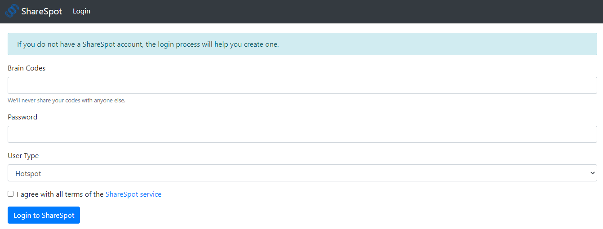

# ShareSpot 
A WutongChain-based Wi-Fi Sharing Platform.

- [WutongChain](https://www.wutongchain.com/) is a blockchain platform developed by Suzhou Tongji Blockchain Research Institute.

- This **ShareSpot** project is prepared for 2020 [ChainValley Cup](https://lgb.wutongchain.com/) competition held in China.
- **ShareSpot** is initially developed by the team from National Communications Research Lab., Southeast University. The team members include R. Guo, Y. Le, Z. Gao, Y. Wang, and Z. Yang. Among them, R. Guo is responsible for WutongChain smart contract development, and Y. Le develops middleware and front-end pages. 
- Copyrights are reserved to the development team. Any modification and commercial use is strictly prohibited without the team's authorization.

 

## Prerequisite

1. Deploy Apache and PHP on your Linux-based server and upload `proxier.php` to your online html directory.
2. Visit http://your_ip_address/proxier.php to test whether the proxy can be reached.
3. Copy the rest of files and directories to mobile devices or your own server. (Due to the limited time, we only tested it on our server.)
4. Open `js/wutong-api.js`, and modify Line 8 `proxy` value with your own `proxier.php` address.
5. Visit `index.html` on the mobile devices or your server, and ENJOY!

## Usage

**ShareSpot** is a Wi-Fi sharing platform for both resource holders and ordinary users. For resource holders, they can log in as `HotSpot` from `index.html` and publish their idle Wi-Fi resources for users to purchase. Ordinary users can log in as `Consumer` from `index.html` and request their ideal resources from resource holders. **ShareSpot** is believed to have breached the barrier between different resource owners and provided a safe and public platform for users to access available Wi-Fi resources from everywhere. With the help of WutongChain (a blockchain-based platform), the transactions between resource holders and users can be extremely secure and smooth. Moreover, due to the decentralized nature of blockchain, the project codes can be directly distributed to any mobile device and commercial hardware.